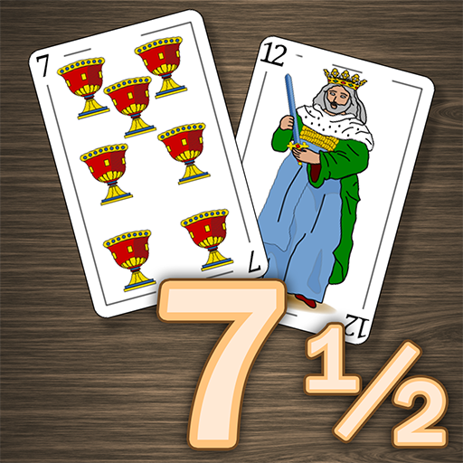

  

# Parcial 2 - "SIETE Y MEDIO"

Se pide construir una aplicación en Java con SpringBoot que permita a una
persona jugar al tradicional juego de cartas del “Siete y medio". 
El juego del Siete y Medio es un clásico de los juegos de cartas, 
muy fácil de jugar y a la vez muy divertido.
El juego consiste en obtener siete puntos y medio, o acercarse a ello 
lo más posible. Las cartas valen tantos puntos como su valor facial, 
excepto las figuras, que valen medio punto.

En el siguiente [link](https://es.wikipedia.org/wiki/Siete_y_media) 
está la explicación completa del juego. A los fines de esta evaluación, 
aplicaremos las siguientes reglas:

* La partida será de 2 jugadores, una persona jugando contra la maquina.
* La maquina **SIEMPRE** será la "banca".
* Todos los jugadores juegan con sus cartas descubiertas.
* Las apuestas del jugador **SIEMPRE** serán de 20 fichas
* La banca paga una cantidad igual al valor de la apuesta del jugador si ha ganado, 
excepto si la jugada que ha obtenido es de las 7 y medio, que cobran el doble de la 
cantidad apostada.
* No se permite "abrir juego" cuando se recibe una figura como primera carta.
* La banca (la maquina) esta obligada a jugar cartas (pedir) hasta que alcance al menos 5 puntos,
momento en el cual se plantará automaticamente.
* Cada mano la gana quien tenga mas puntos. 
  * Si ambos se pasan el jugador no recibe ni pierde fichas, pero gana la maquina.
  * Si ambos suman la misma cantidad de puntos, gana la maquina.
  * Si el jugador es quien gana, se le paga en el balance como se explicó mas arriba.
  * Si el jugador pierde, se le descuenta del balance el valor de la apuesta.
* Si el jugador no tiene mas fichas, no podrá seguir jugando.
* El jugador decide cuando iniciar una partida y cuando terminarla.
* En cada mano de la partida el mazo se mescla para jugar.

La aplicación debe cumplir con los siguientes requisitos:

1. La aplicación debe permitir a un jugador darse de alta como tal pidiendo 
Usuario, Email y Contraseña
   1. No debe permitir dar de alta mas de un jugador con el mismo user_name o email.
   Si el email o el user_name ya existen debe retornar ("The user_name or email already exists")
   2. El email debe tener un formato valido o sino la api debe retornar ("The email format it's not valid")
   3. Al momento del alta, le dará 1000 fichas de regalo en su balance.
2. La aplicación debe permitir al jugador iniciar una partida y finalizarla cuando lo desee.
3. La aplicación solo debe permitir una y solo una partida iniciada por jugador al mismo tiempo.
4. La aplicación solo debe permitir una y solo una mano iniciada por partida al mismo tiempo.
5. La aplicación iniciará sin una mano (Round) iniciada, el jugador debe decirdir iniciarla
y entre mano y mano puede decidir dejar de jagar.
6. Iniciada la mano la aplicación debe repartir una carta para el jugador y una carta para la maquina.
Debe retornar al jugador la lista de cartas en la mesa con su carta inicial, 
los puntos acumulados en la mano y si sigue en juego.
7. Si el jugador pide otra carta, debe tomar la siguiente del mazo recalcular la jugada y retornar el mismo objeto de antes.
Si el jugador se pasó de siete y medio (7,5), la maquina automaticamente jugará sus cartas y agregará a la información anterior
el resultado de la mano.
8. Si el jugador no pide carta y decide plantarse (ceder el turno a la maquina) la maquina automaticamente jugará sus cartas y agregará a la información anterior
el resultado de la mano.
9. Para volver a jugar, el juegador debe iniciar una nueva mano. Tambien puede abndonar la partida o dejarla abierta.
